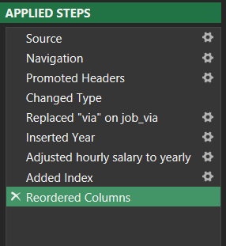
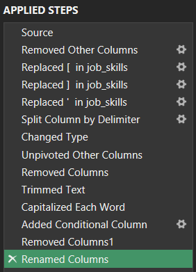
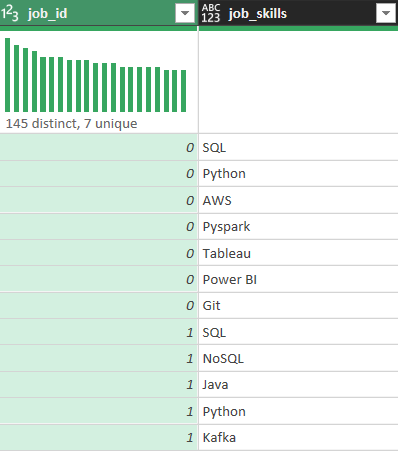
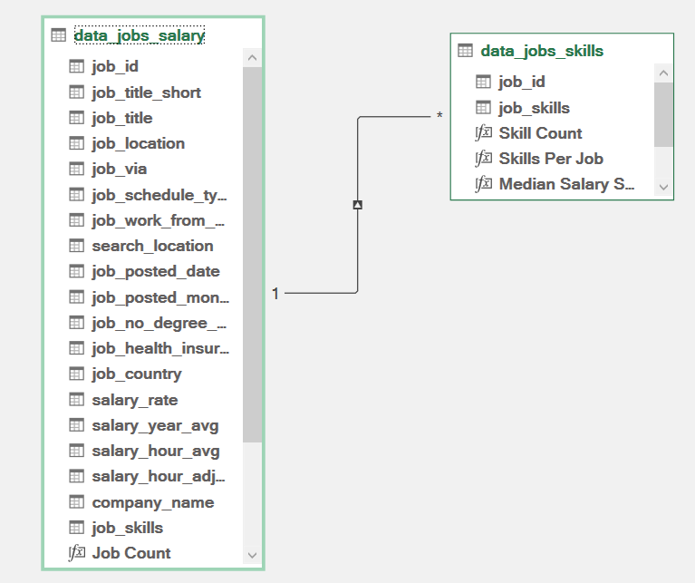
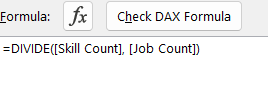
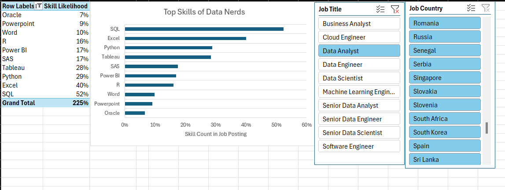
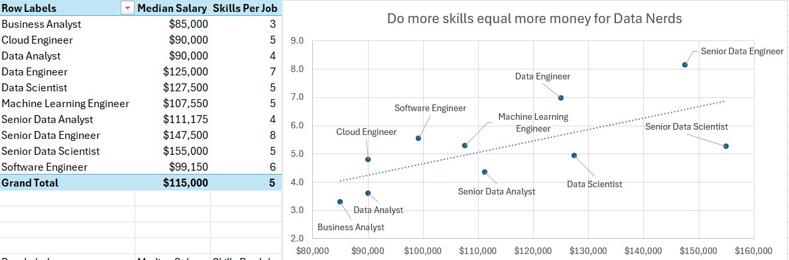
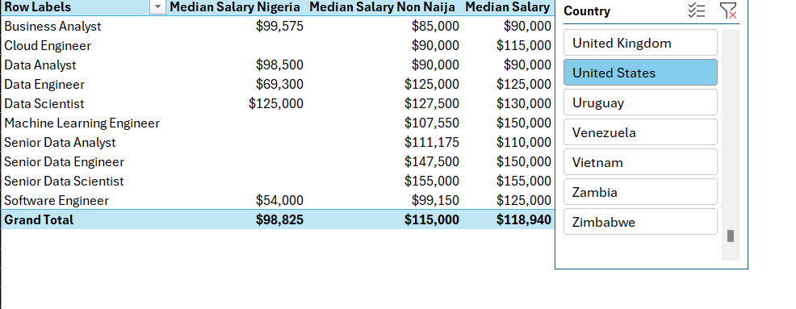
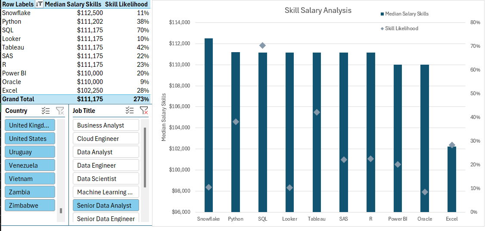

# 📊 Advanced Excel Job Market Analysis (Power Query, Power Pivot & DAX)

## 📌 Project Overview

In this project, I worked with the same dataset from my [first project](https://github.com/Bryanzu/Excel_Project_Data_Analysis) of over **30,000 job postings** from 2023, but this time I moved beyond basic Excel formulas and built a more advanced analytical model using:

- Power Query  
- Power Pivot  
- DAX (Data Analysis Expressions)  
- Pivot Tables  
- Pivot Charts  
- Slicers  
- Data Model Relationships  

The goal of this project was to transition from simple dashboard building to **data modeling and relational analysis inside Excel**.

Instead of working with a single flat table, I transformed the dataset into a structured data model and performed deeper analysis on:

- Skill demand  
- Skill likelihood  
- Skill vs salary relationships  
- Salary comparisons across countries  
- U.S. vs Non-U.S. salary analysis  

---

## 📂 Dataset

- **Source:** Dataset from Luke Barosse’s Excel course, containing real-world job postings from 2023  
- **Size:** 30,673 rows  
- **Original Structure:** Single table containing job titles, country, salary, skills, platform, and other attributes  

---

## 🔄 Data Transformation (Power Query – ETL Process)

In this project, I used **Power Query** to perform proper ETL (Extract, Transform, Load).

### 1️⃣ Creating Two Structured Queries

From the original dataset, I created:

### A. `Data_Job_Salary` (Main Table)
Contains:
- Job Title  
- Country  
- Yearly Average Salary 
- Platform  
- Employment Type  
- Job Skills  
- Other job-related columns  

Transformations performed:



The added Index column `Job ID` became the primary key for relational modeling.

---

### B. `Data_Job_Skills` (Extracted Skills Table)

From the main dataset, I created a second query and applied the following transformations to extract skills:




This resulted in a properly structured **one-skill-per-row dataset**, enabling relational analysis.



---

## 🧩 Data Modeling (Power Pivot)

After cleaning the data, I:

- Loaded both queries into **Power Pivot**
- Added them to the **Data Model**
- Created a relationship between:
  
```
Data_Job_Salary[Job ID]  →  Data_Job_Skills[Job ID]

```


This allowed me to perform cross-table analysis using DAX measures.

---

## 📐 DAX Measures & Analysis

### 1️⃣ Skill Likelihood Analysis

I wanted to determine:

> Which skills occur most frequently relative to total jobs postings?

To achieve this, I created a DAX measure:



Where:
- **Skill Count** = Number of times a skill appears
- **Job Count** = Total number of jobs

This measure allowed me to identify:

- Highly important skills based on Job title (high likelihood)
- Rare or less important skills (low likelihood)

I used:
- Pivot Tables  
- Pivot Charts  
- Slicers (Job Title, Country)

This made the analysis dynamic and filterable.



---

## 💰 Skill vs Salary Analysis

I analyzed whether:

> More skills = Higher salary?

Steps:

- Calculated median salary per job title  
- Measured skill count per job  
- Compared skill density against salary  

This helped identify whether:
- High-paying roles require more skills
- Or whether specific specialized skills influence salary more than skill quantity



---

## 🌎 Salary Analysis (Geographic Comparison)

I performed a country-level salary breakdown:

- Median Salary (Nigeria)
- Median Salary (Non-Nigeria)
- Median Salary (Based on Selected Country e.g U.S)

This allowed direct comparison between:
- Nigeria salary levels  
- Global salary levels  
- Specific country filters  

Slicers were added for:
- Job Title  
- Country  



---

## 🧠 Skill Salary vs Skill Likelihood Insight

One of the most important analyses in this project was combining:

- **Median Salary per Skill**
- **Skill Likelihood**

This allowed classification of skills into categories:

| Skill Type | Interpretation |
|------------|----------------|
| High Likelihood + Low Salary | Common foundational skill |
| Moderate Likelihood + Moderate Salary | Important and widely used |
| Low Likelihood + High Salary | Rare, specialized, high-value skill |

This provided deeper labor market insight beyond simple averages.


---

## 🎛 Interactive Features

This project heavily used:

- Pivot Tables  
- Pivot Charts  
- Slicers  
- Data Model relationships  
- DAX Measures  

All reports were dynamic and filterable by:
- Job Title  
- Country  

---

## 🛠 Tools & Technologies

- Microsoft Excel  
- Power Query  
- Power Pivot  
- DAX  
- Pivot Tables  
- Pivot Charts  
- Slicers  
- Data Modeling  

---

## 🧠 What I Learned

This project significantly improved my understanding of:

- Proper ETL workflow inside Excel  
- Building relational data models  
- Creating primary keys and relationships  
- Writing DAX measures  
- Difference between calculated columns and measures  
- When to normalize a dataset  
- How to structure many-to-one relationships  
- Using the Data Model effectively  

The biggest shift for me was moving from:

> Flat-table analysis → Relational modeling mindset

I also learned that:

- Cleaning and structuring data properly makes analysis easier  
- DAX provides more flexibility than traditional Excel formulas  
- Skill importance is better measured using ratios, not raw counts  
- Salary insight becomes more meaningful when combined with skill frequency  

---

## 📁 Project Structure

```

Advanced-Excel-Job-Analysis/
├── images/
├── Raw_Dataset.xlsx
├── Advanced_Excel_Model.xlsx
└── README.md

```

---

## ▶️ How to Use

1. Open `Advanced_Excel_Model.xlsx`
2. Use slicers to filter by:
   - Job Title  
   - Country  
3. Explore:
   - Skill Likelihood Analysis  
   - Skill vs Salary Reports  
   - Salary Comparison Reports  

Ensure Power Pivot and Data Model features are enabled in Excel.

---

## 🚀 Skills Demonstrated

- Advanced Excel modeling  
- ETL with Power Query  
- Data normalization  
- Relationship modeling  
- DAX measure creation  
- Analytical thinking  
- Labor market skill analysis  
- Dynamic reporting  

---

## 📌 Conclusion

This project represents my transition from basic Excel dashboards to advanced data modeling using Power Query, Power Pivot, and DAX.

It strengthened my ability to:
- Structure messy data
- Design relational models
- Perform multi-table analysis
- Extract deeper insights from job market data

